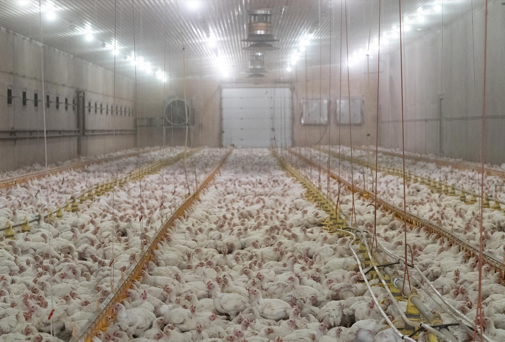
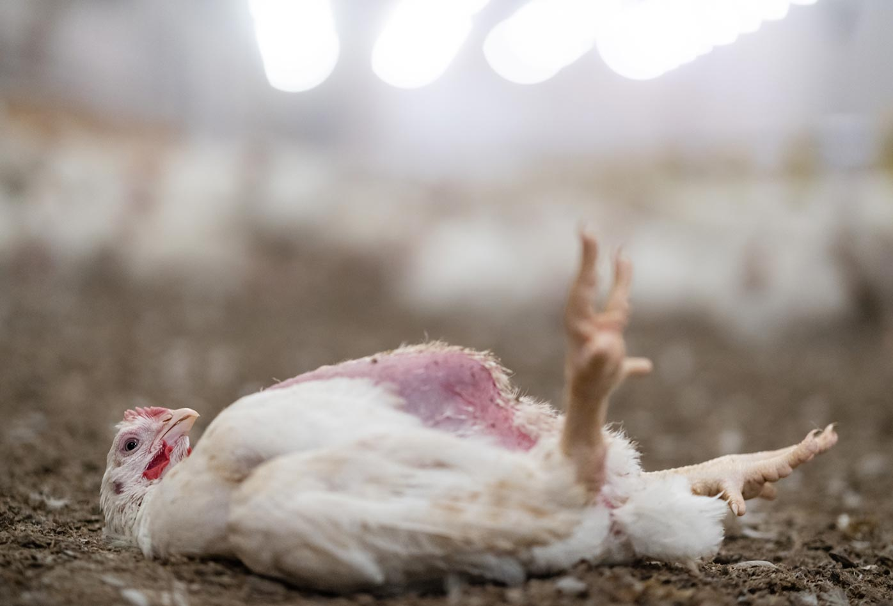
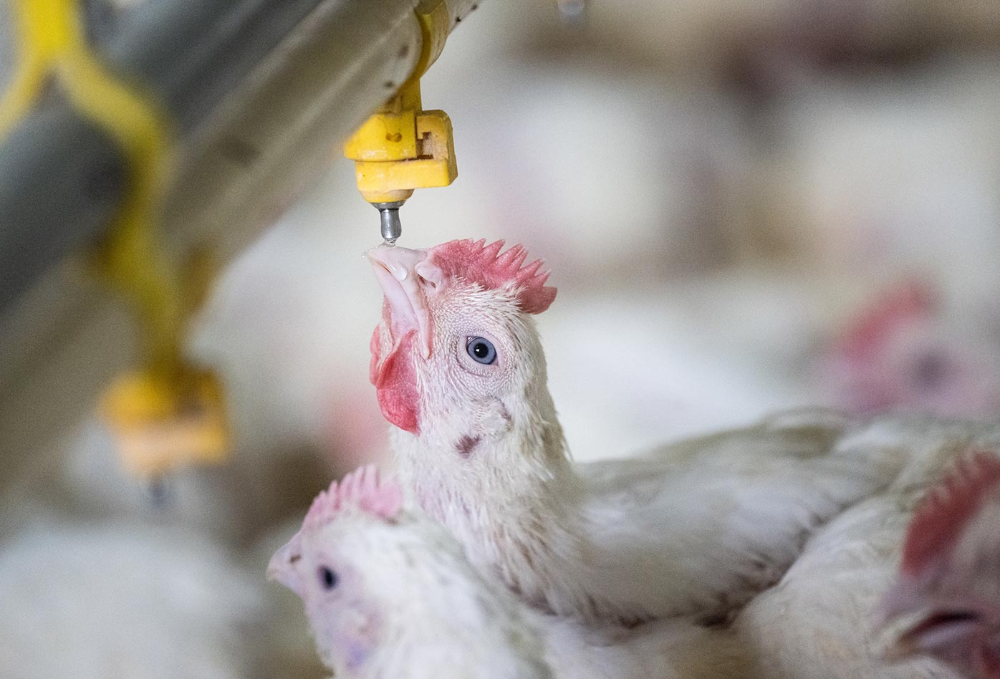

 Contiene imágenes sangrientas.

En la lección sobre la [la industria del huevo.](/leccion-la-industria-del-huevo/){:class="link no-underline" target="_blank"} cubrí las características de la especie _Gallus Gallus domésticus,_ y algunas de las prácticas de la industria que explota a las gallinas. Para criar pollos de engorde las prácticas son diferentes, se usan otras razas, y usualmente los animales explotados son machos porque pueden crecer más.

_Gallus Gallus domésticus_ es la especie de animales domésticos con más individuos asesinados para carne. En Estados Unidos son 9 billones al año constituyendo el 95% de animales asesinados para uso comercial.

Las razas usadas para engordar y producir carne son _Ross,_ _Cobb_ y _Avian Cobb,_ seleccionadas según la velocidad de crecimiento, el peso y el clima en donde se crían a los animales. Libres de explotación podrían vivir entre 8 y 15 años, mientras que como productos de la industria su expectativa de vida es generalmente de 42 días o menos. Debido al avance en las técnicas de reproducción selectiva y crianza, estos animales alcanzan el nivel esperado de producción de unos 2.8 kilogramos en menos de la mitad del tiempo que se requería hace cien años cuando el pollo o la gallina de engorde promedio alcanzaba su peso para el mercado en unos 112 días. Como consecuencia de esta optimización, más de una cuarta parte de la población de estos animales crecen de una manera que sus cuerpos no pueden soportar, tienen dificultades para sostener su peso corporal y mantenerse en pie, razón por la que son más vulnerables a la contaminación proveniente del amoniáco que proviene de sus propias heces, que termina quemando sus patas y pechos, causando problemas de respiración, cojera y fallos cardíacos, siendo el fallo cardíaco la mayor causa de mortalidad en los pollos que alcanzan su peso para el mercado. 

En los últimos 50 años, la tasa de crecimiento de los pollos y gallinas de engorde se ha incrementado en un trescientos por ciento, de 25 a 100 gramos al día.

En la crianza intensiva los animales viven en galpones gigantes con hasta 20000 gallinas y pollos, y a medida que van creciendo el espacio disponible disminuye. Aunque no se confinan en jaulas como las gallinas ponedoras, habitan en un área que sería equivalente al tamaño de una hoja carta, lo que les genera estrés y frustración adicional. En casos de hacinamiento, es recomendable mutilar los picos de las víctimas, para evitar que se ataquen entre sí, y se dañe la mercancía. La práctica del despique la expliqué en la lección sobre [la industria del huevo.](/leccion-la-industria-del-huevo/){:class="link no-underline" target="_blank"}

Aunque en los manuales se recomienda limpiar y desinfectar los galpones antes de recibir un nuevo lote, en una producción intensiva podría usarse el galpón sin desinfectar para varias bandadas. Independientemente de que el galpón se limpie o no antes de recibir a las nuevas víctimas, los niveles de amoniáco resultado de la descomposición de heces y orina son peligrosos.

Es normal que mueran pollos durante la crianza, por lo que los manuales recomiendan retirarles, llevarles a un compostero y evitar venderlos, enterrarlos o utilizarlos para alimentar a otros pollos.

[Pollitos de quince días de nacidos, criados para carne, llamados pollos de engorde, se mueven dentro de un galpón y comen de un dispensador en el piso, en una granja de pequeña escala. La granja enviará a los pollos al matadero cuando alcancen unos 40 o 50 días de edad. África Subsahariana, 2002. Jo-Anne McArthur・We Animals Media](https://stock.weanimalsmedia.org/search/?searchQuery=WAM30201&assetType=default){:target='_blank' class="caption"}

## Incubación y nacimiento

Pollos y gallinas de engorde generalmente no son empollados por sus madres sino incubados en máquinas que mueven los huevos y les mantienen en la temperatura y humedad adecuada para el desarrollo de los embriones hasta que son polluelos y pueden romper el cascarón. Estos animales nacen en una canasta y luego son seleccionados por su sexo. El sexo se determina observando el emplumado rápido y las líneas en el ala de las hembras. A diferencia de la industria del huevo en donde a los machos se les asesina inmediatamente en una práctica conocida como _Chick culling,_ en la crianza de pollos y gallinas de engorde no se descartan individuos dependiendo de su sexo, pero sí se les separa antes del engorde. No tengo muy clara la razón por la que se separan, pero probablemente puede tener que ver con diferencias en el precio de machos y hembras debido a la cantidad de carne que pueden producir.

Después del nacimiento las víctimas son transportadas a la granja de levante.

[Miles de jóvenes pollos viven hacinados dentro de un galpón en una granja avícola. Eurajoki, Finlandia, 2019. Benjamin Blomstedt・We Animals Media](https://stock.weanimalsmedia.org/search/?searchQuery=WAM29964&assetType=default){:target='_blank' class="caption"}

[Incapaz de pararse, un joven pollo yace indefenso sobre su espalda, en el suelo de un granero, en una granja avícola. Eurajoki, Finlandia, 2019. Benjamin Blomstedt・We Animals Media](https://stock.weanimalsmedia.org/search/?searchQuery=WAM29959&assetType=default){:target='_blank' class="caption"}

## Levante y engorde

Polluelos y polluelas se hacinan en galpones donde reciben vacunas por medio de gotas en los ojos, se alimentan de concentrado y se manipula la luz del recinto dependiendo de la raza para aumentar la productividad, usualmente se puede someter a los animales a entre 21 y 23 horas de luz entre natural y artificial, con intensidad de luz y frecuencia variada. La manipulación lumínica se usa con la intención de aumentar la actividad y el consumo de concentrado. Debido a que las aves no pueden vivir según los ciclos naturales de luz, no pueden descansar y dormir normalmente, lo que también puede generar serios problemas de salud.

En unos 37 a 42 días los pollos están listos para ser llevados al matadero.

El ayuno antes del asesinato es de entre siete y nueve horas, tiempo durante el que se les suministra agua únicamente.

[Uno de las 33,000 pollos criados por su carne, bebe de un caño en una hacinado galpón, en una granja industrial de pollos de engorde. Eventualmente vivirán 12,000 pollos en la granja. África Subsahariana, 2002. Jo-Anne McArthur・We Animals Media](https://stock.weanimalsmedia.org/search/?searchQuery=WAM29645&assetType=default){:target='_blank' class="caption"}

[En una granja procesadora de pollos en Grecia, los órganos internos de los pollos asesinados, son removidos por una trabajadora y puestos en una cinta transportadora mecanizada. Esta planta tiene la capacidad de procesar hasta 10,000 aves al día, y surte supermercados del país. Milos Bicanski・We Animals Media](https://stock.weanimalsmedia.org/search/?searchQuery=WAM25411&assetType=default){:target='_blank' class="caption"}

## Asesinato (Sacrificio)

Los pollos y gallinas de engorde todavía pían como polluelos cuando se llevan al matadero, a pesar de que sus cuerpos son desproporcionadamente grandes. Aunque a legislación de Estados Unidos no exige que a las aves sean asesinadas "humanitariamente", igualmente son sometidas a un choque eléctrico para lo que la industria llama "insensibilizar", pero sabemos que más que una insensibilización, esta práctica es un aturdimiento doloroso.

<iframe src="https://www.youtube.com/embed/bpKPDkH0R2s" frameborder="0" allow="accelerometer; autoplay; clipboard-write; encrypted-media; gyroscope; picture-in-picture" allowfullscreen></iframe>

[Pollo Para Carne; Incubación y Pollo de Engorde・Juan Gonzalo Ángel・TvAgro・Youtube](https://www.youtube.com/watch?v=bpKPDkH0R2s){:target='_blank' class="caption"}

En el video se pueden observar víctimas con dificultades para caminar.

<iframe src="https://www.youtube.com/embed/dIkb8ugGmP0" frameborder="0" allow="accelerometer; autoplay; clipboard-write; encrypted-media; gyroscope; picture-in-picture" allowfullscreen></iframe>

[Planta Manual Avícola para procesamiento de 60 pollos por hora・Tekpro S.A・Youtube](https://www.youtube.com/watch?v=dIkb8ugGmP0){:target='_blank' class="caption"}

<iframe src="https://www.youtube.com/embed/Cgw6KoUAqRo" frameborder="0" allow="accelerometer; autoplay; clipboard-write; encrypted-media; gyroscope; picture-in-picture" allowfullscreen></iframe>

[Paso Matanza Del Pollo A Manual Engorde Técnicas Para Sacrificar Proceso Sacrificio De Pollos・Qingdao RANICHE Poultry Slaughter Equipment・Youtube](https://www.youtube.com/watch?v=Cgw6KoUAqRo){:target='_blank' class="caption"}

Gallinas y pollos se cuelgan por sus patas en una línea transportadora, se les suministra un choque eléctrico para aturdirles y regular su presión arterial para facilitar el proceso de desangrado.

A los animales se les asesina mediante un corte en el pescuezo y se les deja desangrar, mientras la máquina les transporta para continuar con el proceso de escaldado, en el que sus cadáveres se sumergen en agua caliente para luego ser desplumados al ser pasados por unos dedos de cucho, el paso siguiente al desplumado es la envisceración en donde la máquina remueve las viscéras de los animales con ayuda de las y los trabajadores, la máquina degolla los cadáveres para que pasen a ser empacados completos o descuartizados.

Observar los procesos me recuerda que los desarrollos tecnológicos usualmente terminan en la automatización y optimización de la crueldad.

### Referencias

* [Manejo de pollo de engorde・Daniel Adolfo Acosta Paéz, Álvaro Jaramillo Benavides・Servicio Nacional de Aprendizaje](https://repositorio.sena.edu.co/bitstream/handle/11404/4618/Manejo_de_pollo_de_engorde.PDF){:target='_blank' class="reference"}

* [Welfare concerns for broiler chickens・University of Bristol](http://www.bris.ac.uk/news/2008/5811.html){:target='_blank' class="reference"}

* [Producir pollo de engorda es altamente rentable: Dra. Pilar Castañeda, UNAM・El Siglo de Durango・Avicultura.mx](https://www.avicultura.mx/destacado/Producir-pollo-de-engorda-es-altamente-rentable:-Dra.-Pilar-Castaneda,-UNAM){:target='_blank' class="reference"}

* [Producir pollo de engorda es altamente rentable: Dra. Pilar Castañeda, UNAM・El Siglo de Durango・Avicultura.mx](https://www.avicultura.mx/destacado/Producir-pollo-de-engorda-es-altamente-rentable:-Dra.-Pilar-Castaneda,-UNAM){:target='_blank' class="reference"}

* [Pollo Para Carne; Incubación y Pollo de Engorde・Juan Gonzalo Ángel・TvAgro・Youtube](https://www.youtube.com/watch?v=bpKPDkH0R2s){:target='_blank' class="reference"}

* [Planta Manual Avícola para procesamiento de 60 pollos por hora・Tekpro S.A・Youtube](https://www.youtube.com/watch?v=dIkb8ugGmP0){:target='_blank' class="reference"}

* [Paso Matanza Del Pollo A Manual Engorde Técnicas Para Sacrificar Proceso Sacrificio De Pollos・Qingdao RANICHE Poultry Slaughter Equipment・Youtube](https://www.youtube.com/watch?v=Cgw6KoUAqRo){:target='_blank' class="reference"}

* [Cómo manejar la luz en los pollos de engorde para que crezcan rápido y sanos・Animal Production Consultoría y Comercialización・Youtube](https://www.youtube.com/watch?v=bpKPDkH0R2s){:target='_blank' class="reference"}

* [Pollos de granja・Veganuary](https://veganuary.com/es/pollos/){:target='_blank' class="reference"}

* [Chickens・Farm Sanctuary](https://www.farmsanctuary.org/chickens/){:target='_blank' class="reference"}