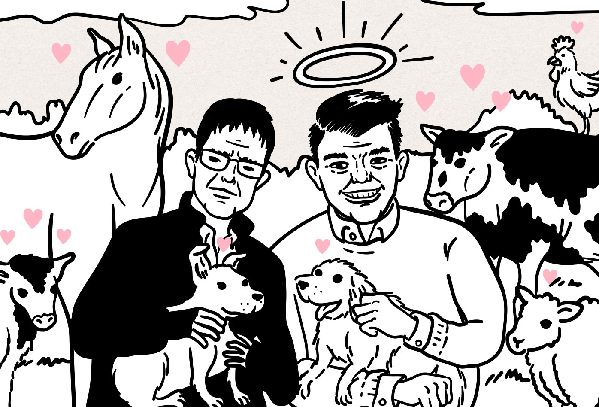

Por el material de las campañas y las redes sociales de Álvaro Múnera Builes, Juan Esteban Builes "Goyo", Juan Jiménez Lara y Edison Molina Ortíz, quienes se destacan por su trabajo por la defensa de los animales, más sus comentarios generalmente acertados acerca de políticas animalistas, parecería que votar por ellos es "votar por los animales"; sin embargo si los intereses del partido político al que pertenecen fuesen los intereses de los animales, tendría que decir que afortunadamente los animales no pueden votar (los no humanos al menos). Aunque no pongo en duda el trabajo que hacen por la causa animalista, no podría confiar en el partido al que pertenecen ni estar deacuerdo con la mayoría de posturas del la colectividad frente a otros temas. Las corporaciones gubernamentales no son espacios donde se discutan y se legislen únicamente asuntos relacionados al animalismo y el veganismo, ni las y los funcionarios pueden ir a sesionar únicamente cuando la agenda incluya las causas que promocionan en sus campañas, o tampoco pueden actuar independientemente de sus movimientos y partidos. Deben aceptar sus estatutos y actuar bajo sus programas, por lo que siempre hay que analizar desde cuáles partidos y movimientos vienen quienes piden nuestro voto por los animales, y cuáles son sus posturas frente a otros temas relevantes a nuestros intereses.

El partido al que pertenecen el diputado Álvaro Múnera Builes y los demás candidatos es el Partido Conservador, (el de Dios y Patria); la ideología del Partido Conservador se define en unos estatutos y un manual que se pueden consultar en su sitio web [partidoconservador.com/normatividad.](https://www.partidoconservador.com/normatividad/){:target="_blank" class="link"} Aparte de estatutos y demás, hay que tener en cuenta las acciones. En mi opinión es una colectividad que se mueve por conveniencia hacia donde vaya el poder, defensora de los intereses de la clase depredadora, militarismo, imperialismo, y la negación de los derechos sexuales y reproductivos.

Nadie que pertenezca al partido puede tomar decisiones que vayan en contra de las directrices de la colectividad que tiene a Efraín Cepeda como presidente, y tuvo al pena ajena David Barguil como candidato presidencial. Según los estatutos del partido, los candidatos deben mover su poder político para apoyar las candidaturas de su partido, y votar por sus candidatos o candidatas, o por las y los de la coalición que integren para alcaldías, gobernaciones, presidencia, etc... Seguramente abierta o solapadamente uribistas, y definitivamente abierta o solapadamente de derecha o ultraderecha, al servicio de la clase depredadora.

Revisando el _Manual del Conservador,_ encontré una postura no muy compatible con el discurso de que los animales no nos pertenecen: _"Dios creó los animales, las plantas y demás seres vivos y el resto de la naturaleza para beneficio del hombre"_ - Manual del Conservador / Página 25. Me llamó la atención, pero no es tan importante porque el resto de integrantes del partido tampoco parecen seguir el manual en lo que respecta al rechazo al neoliberalismo económico, ni los valores de la justicia y la solidaridad, o la virtud personal. Aunque en la mayoría de partidos y movimientos hay gente deshonesta que comete actos de corrupción, el partido que pide un voto por los animales, parece ser muy atractivo para personas en las que no es buena idea confiar. Acá una lista de algunos casos destacados:

<h5>Luis Alfredo Ramos</h5>

Exgobernador de Antioquia condenado por concierto para delinquir agravado con la finalidad de promover grupos paramilitares.

<h5>Marta Lucía Ramírez</h5>

Ministra de defensa del ex-presidente Álvaro Uribe durante la operación Orión, ex-vicepresidenta del gobierno de Iván Duque, y destacada por sus tragedias familiares. Su esposo Álvaro Rincón presuntamente fue socio del testaferro del paramilitarismo Memo Fantasma, y presuntamente está involucrado en la violación del Plan de Ordenamiento Territorial en San Andrés.

<h5>Andrés Felipe Árias</h5> 

Llamado "Uribito" por su cercanía con Álvaro Uribe Vélez y condenado por celebración de contratos sin el cumplimiento de los requisitos legales en el caso Agro Ingreso Seguro.

<h5>Andrés Pastrana</h5>

Expresidente presuntamente financiado por el paramilitarismo según las declaraciones de Salvatore Mancuso, y uno de los tripulantes del _Lolita Express_ de Jeffrey Epstein, en Marzo de 2003, hay que anotar que aunque los crímenes de Epstein empezaron a descubrirse en el 2005, en los mismos vuelos viajó un supuesto criminal detenido por crímenes sexuales: Jean Luc Brunel. Las explicaciones del ex-presidente sobre el incidente no son muy satisfactorias.

<h5>Aida Merlano</h5>

Condenada por corrupción al sufragante agravado, o compra de votos.

<h5>William Montes Medina</h5>

Condenado por concierto para delinquir, relacionado con el paramilitarismo.

<h5>Yidis Medina</h5>

Condenada por cohecho propio en el caso de la fraudulenta reelección de Álvaro Uribe Vélez.

<h5>Óscar Suárez Mira</h5> 

Condenado por enriquecimiento ilícito y concierto para delinquir agravado, relacionado con el paramilitarismo.

<h5>Alejandro Ordóñez</h5>

Fanático religioso y fascista que usó a la procuraduría como una agencia al servicio de sus intereses políticos.

<h4>Sobre Álvaro Múnera y su movimiento político</h4>

Además de votar a favor de darle facultades extraordinarias a Aníbal Gaviria, y a favor de la obra _Parques del Río,_ desconozco cuáles son las iniciativas no relacionadas con animalismo que ha apoyado o rechazado el diputado Álvaro Múnera, en parte porque rara vez las menciona, pero sí puedo hablar de los políticos que ha apoyado según el medio independiente _Punto de Vista_ que no parece muy confiable pero tampoco pareciera tener razones para calumniar al diputado, el animalista Múnera apoyó la candidatura de Alfredo Ramos Maya del Centro Democrático, a la alcaldía de Medellín, hasta que declinó su apoyo al partido de Uribe Vélez debido a su molestia porque el gobierno del ex-presidente Duque no terminó de cumplir con su compromiso de ratificar una ley que incluya la atención a los animales víctimas de accidentes de tránsito dentro del _Seguro Obligatorio de Accidentes de Tránsito (SOAT)._ La molestia de Múnera en contra del Centro Democrático no fue causada por las medidas depredadoras del infame ex-ministro de hacienda de Duque, Alberto Carrasquilla contra la clase trabajadora, ni por los abusos de la fuerza pública durante el paro nacional, ni por el bombardeo de menores de edad "máquinas de guerra", ni por el desastroso manejo de la seguridad que desencadenó en la multiplicación de los grupos armados ilegales por todo el país, ni por los innumerables casos de corrupción, o por la presunta relación de Duque con el narcotraficante Ñeñe Hernández, sino por la falta de compromiso con una iniciativa con la que no podría estar en desacuerdo pero que para una persona que no esté completamente alienada por una visión misántropa de la solidaridad con los animales, no parece demasiado trascendente, en comparación con tantas otras acciones indignantes cometidas por dicha administración. Lo que no debería sorprenderme viniendo de alguien que al igual que Goyo replica el discurso simplista y moralista, en el que la chusma inmoral es responsable en igual medida por la explotación y violencia sistemática de la que se benefician económicamente, de una manera bien desproporcionada, un grupo más reducido de personas, quienes a su vez también controlan las narrativas y los medios de producción y distribución. (Tyson Foods, Cargill, JBS, etc...)

<iframe src="https://www.youtube.com/embed/fgjgnXTYK5U?si=ZwEKOy65fZmz-kFQ" frameborder="0" allow="accelerometer; autoplay; clipboard-write; encrypted-media; gyroscope; picture-in-picture" allowfullscreen></iframe>

[‘Estudien vagos’: el polémico grito de Cabal a unos manifestantes・Cablenoticias](https://www.youtube.com/watch?v=fgjgnXTYK5U){:target='_blank' class="caption"}

Alfredo Ramos Maya, acompañando a Maria Fernanda Cabal cuando le grita: "Estudien vagos" a manifestantes en un homenaje a las víctimas de la violencia. El ex-candidato a la alcaldía de Medellín le grita a los manifestantes: "aprendan historia". - Eso hago, gracias :)
{:class="caption-no-link"}

Luego de declinar su apoyo a Ramos Maya, Múnera decidió apoyar al también uribista Luis Carlos Vélez, conocido por revelar accidentalmente la campaña de manipulación mediática para promover el "no" en el plebiscito para refendar los acuerdos de paz con las FARC. Vélez es el "compañero que no cuida las comunicaciones".

El movimiento al que pertenece el diputado Múnera es _Conservadores de vida,_ liderado por el ex-senador y actual candidato a la gobernación de Antioquia Juan Diego Gómez; sus demás integrantes son Nicolás Echeverry, Juan Esteban Villegas y Jhon Jaime Moncada. El movimiento se presenta con un discurso razonable de "familia multiespecie", "protección a los derechos de los seres sintientes", "desarrollo sostenible, responsable y equitativo", y "urbanismo sostenible de adaptación al cambio climático". Causas que Gómez no menciona en sus intervenciones como candidato a la gobernación de Antioquia.

El jefe directo de Álvaro Múnera, aunque no ha sido condenado tampoco parece una persona muy confiable. Además del manejo mañoso e irrespetuoso del debate durante su presidencia en el senado, la narrativa politiquera que se puede evidenciar en sus perfiles en redes sociales, más su apoyo a figuras cuestionables como Fico Gutiérrez, el _Conservador de vida_ Gómez, es uno de los miembros del comité promotor del referendo pro-vida, que busca prohibir el aborto; iniciativa que tiene su origen en la organización político-religiosa _Lazos de Amor Mariano._ Como reporta el medio _Vorágine_, _"El poder que han adquirido causa temor en quienes defienden los derechos sexuales y reproductivos en el país."_

<iframe src="https://www.youtube.com/embed/4uDm6SZwiss?si=lt0A7luNTKWvTDIs" frameborder="0" allow="accelerometer; autoplay; clipboard-write; encrypted-media; gyroscope; picture-in-picture" allowfullscreen></iframe>

[Juan Diego Gómez tenía proyectos en común con el senador Mario Castaño・Vorágine](https://www.youtube.com/watch?v=4uDm6SZwiss){:class="caption"}

Adicionalmente, según Vorágine, el candidato Juan Diego Gómez estuvo presuntamente involucrado como coordinador en la estructura criminal del ex-senador del Partido Liberal Mario Castaño, condenado por liderar una red de corrupción para direccionar contratos de recursos públicos. Gómez también está denunciado por robo de tierra. El mismo medio informa que Juan Diego Gómez, junto con su hermano David Orlando Gómez Jimenez, director de la Central de Inversiones S.A (CISA) en Antioquia, estarían siendo investigados por la Corte Suprema de Justicia por presuntamente negociar bienes de extinción de dominio con Andrés Ávila, expresidente de la Sociedad de Activos Especiales (SAE), entidad que administra las propiedades del estado.

> "Los antecedentes del nuevo presidente del Senado de la República incluyen un negocio con dos socios de un narcotraficante, una denuncia por estafa, una disputa familiar por tierras, y el embargo de su apartamento, su sueldo y su carro."
>{: class="p-big"}

[Los negocios turbios del nuevo presidente del Senado・Cuestión Pública・20 de Agosto de 2021.](https://cuestionpublica.com/negocios-turbios-del-nuevo-presidente-del-senado-juan-diego-gomez/){:class="caption" target='_blank'}

> "Cuando Gómez era presidente de la Comisión Quinta de la Cámara (2012 - 2013) tuvo una reunión privada con Eleuberto Martorelli, expresidente de Odebrecht en Colombia. Por esta época Odebrecht pagó al menos 2 millones de dólares en sobornos a senadores y políticos conocidos como "Los Bulldozer". En 2014, el señor César Hernández Sanmartín dio un crédito a la campaña de Gómez Jiménez al senado y seis meses después de las elecciones lavó dinero para la multinacional brasileña, hechos por los cuales fue condenado a casa por cárcel en 2017."
>{: class="p-big"}

[Sabemos lo que hiciste Juan Diego Gómez Jiménez・Cuestión Pública](https://cuestionpublica.com/sabemos-lo-que-hiciste/juan-diego-gomez-jimenez){:class="caption" target='_blank'}

<iframe src="https://www.youtube.com/embed/H1aKE2TthQE?si=wuOYdkvtx7TdQiCd" frameborder="0" allow="accelerometer; autoplay; clipboard-write; encrypted-media; gyroscope; picture-in-picture" allowfullscreen></iframe>

[Juan Diego Gomez - C-14 SENADO @juandiegogj・Marta Lucía Ramírez](https://www.youtube.com/watch?v=H1aKE2TthQE){:class="caption"}

¿Por los animales todo?

Anotación: Aunque no he estado muy involucrado en este proceso electoral, soy militante del Polo Democrático Alternativo, y reconozco que los partidos y movimientos de izquierda prácticamente desconocen a los animales, sus propuestas a favor de los animales se quedan cortas, y hasta les instrumentalizan para propaganda, pero pensaría que es mejor presionar para cambiar esa situación, u organizar movimientos propios en lugar de unirse a partidos o movimientos hostiles hacia los intereses de la clase trabajadora. La solidaridad por los animales nunca justificará la indiferencia o el desprecio hacia nuestras propias comunidades.

### Referencias

* [Top 5 corrupción Partido Conservador・La Oreja Roja](https://m.laorejaroja.com/top-5-corrupcion-partido-conservadorr){:target='_blank' class="reference"}

* [Memo Fantasma, el socio de Pablo Escobar que le dañó la carrera política a Marta Lucía Ramirez・Las 2 Orillas](https://www.las2orillas.co/memo-fantasma-el-peso-que-carga-marta-lucia-ramirez/){:target='_blank' class="reference"}

* [Esposo de Marta Lucía Ramírez, exsocio de Memo Fantasma violó el POT de San Andrés・Plurarlidad Z](https://pluralidadz.com/politica/esposo-de-marta-lucia-ramirez-exsocio-de-memo-fantasma-violo-el-pot-de-san-andres/){:target='_blank' class="reference"}

* [Partido Conservador: negocios, clientelismo y corrupción・Razón Pública](https://razonpublica.com/partido-conservador-negocios-clientelismo-y-corrupcion/){:target='_blank' class="reference"}

* [Colombia’s former president admits having flown on Jeffrey Epstein’s ‘Lolita Jet’・Colombia Report](https://colombiareports.com/colombias-former-president-on-jeffrey-epsteins-lolita-jet-flight-logbook/){:target='_blank' class="reference"}

* [Epstein Flight Logs Released in Usa-vs-Maxwell](https://s3.documentcloud.org/documents/21165424/epstein-flight-logs-released-in-usa-vs-maxwell.pdf){:target='_blank' class="reference"}

* [The World's Most Valuable Private Companies・Investopedia](https://www.investopedia.com/financial-edge/1112/the-worlds-most-valuable-private-companies.aspx){:target='_blank' class="reference"}

* [¿Quién es Alejandro Ordóñez Maldonado?・Telesur](https://www.telesurtv.net/news/Quien-es-Alejandro-Ordonez-Maldonado-20160907-0044.html){:target='_blank' class="reference"}

* [Conservadores de vida es el nuevo movimiento político en Antioquia・Minuto30](https://www.minuto30.com/conservadores-de-vida-es-el-nuevo-movimiento-politico-en-antioquia/464541/){:target='_blank' class="reference"}

* [Múnera no va・Punto de Vista](https://www.puntodevistardb.com/2019/10/munera-no-va/){:target='_blank' class="reference"}

* [Partidos Liberal y Conservador hacen oficial su apoyo a Iván Duque](https://www.eltiempo.com/elecciones-colombia-2018/presidenciales/partidos-liberal-y-conservador-apoyaran-a-ivan-duque-224402){:target='_blank' class="reference"}

* [Entrevista con Álvaro Múnera, candidato animalista al Concejo de Medellín・Galería Política](https://www.galeriapolitica.com/entrevista-con-alvaro-munera-candidato-animalista-al-concejo-de-medellin/){:target='_blank' class="reference"}

* [Múnera critica a Duque por incumplir promesas animalistas de campaña. Uno de sus seguidores le dice que obviamente eso iba a pasar y que abra los ojos.・Instagram](https://www.picnob.com/post/3769185238646662354166/){:target='_blank' class="reference"}

* [“Hacen daño los compañeros que no cuidan las comunicaciones”: Uribe・El Colombiano](https://www.elcolombiano.com/colombia/alvaro-uribe-regana-a-juan-carlos-velez-por-entrevista-a-la-republica-sobre-campana-del-no-YE5116643){:target='_blank' class="reference"}

* [‘Estudien vagos’: el polémico grito de Cabal a unos manifestantes・Cablenoticias](https://www.youtube.com/watch?v=fgjgnXTYK5U){:target='_blank' class="reference"}

* [Ante la Registraduría quedó inscrito el comité promotor del referendo provida・Radio Nacional de Colombia](https://www.radionacional.co/actualidad/referendo-provida-comite-promotor-contra-el-aborto){:target='_blank' class="reference"}

* [Lazos de Amor Mariano: el catolicismo radical llegó a la política・Vorágine](https://voragine.co/lazosdeamormariano-la-llegada-del-catolicismo-radical-a-la-politica/){:target='_blank' class="reference"}

* [Juan Diego Gómez tenía proyectos en común con el senador Mario Castaño・Vorágine](https://voragine.co/juan-diego-gomez-tenia-proyectos-en-comun-con-el-senador-mario-castano/){:target='_blank' class="reference"}

* [Representante Juan Diego Gómez es denunciado por estafa・Noticias Uno](https://www.youtube.com/watch?v=jWuxh8gsQAY){:target='_blank' class="reference"}

* [El robo de tierras por el que denuncian al próximo presidente del Senado・Vorágine](https://voragine.co/el-robo-de-tierras-por-el-que-denuncian-al-proximo-presidente-del-senado/){:target='_blank' class="reference"}

* [Los negocios turbios del nuevo presidente del Senado・Cuestión Pública](https://cuestionpublica.com/negocios-turbios-del-nuevo-presidente-del-senado-juan-diego-gomez/){:target='_blank' class="reference"}

* [Sabemos lo que hiciste Juan Diego Gómez Jiménez ・Cuestión Pública](https://cuestionpublica.com/sabemos-lo-que-hiciste/juan-diego-gomez-jimenez){:target='_blank' class="reference"}

* [Juan Diego Gomez - C-14 SENADO @juandiegogj・Marta Lucía Ramírez](https://www.youtube.com/watch?v=H1aKE2TthQE){:target='_blank' class="reference"}
