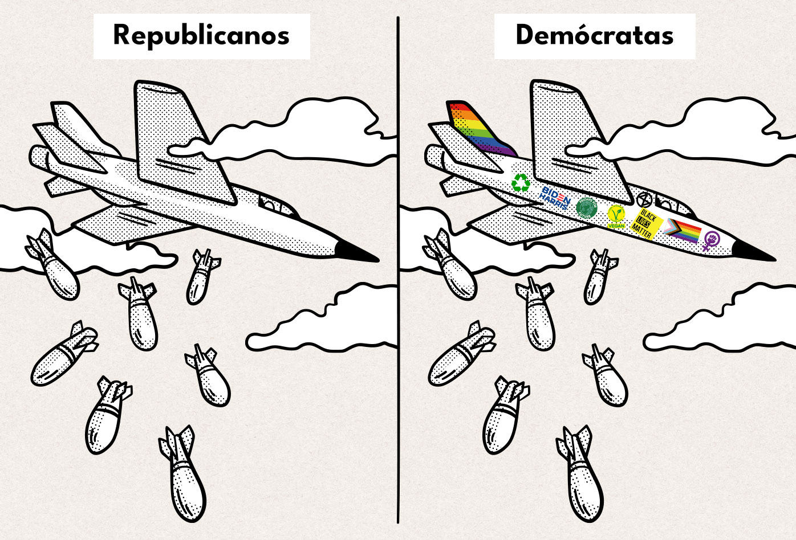

Traducido por Alejandro Narváez Isaza, y publicado acá sin permiso del autor. Artículo original de Febrero 5 de 2023 en [Substack](https://chrishedges.substack.com/p/woke-imperialism){:target="_blank" class="link"} 

La cultura woke, desprovista de conciencia de clase y el compromiso de estar del lado de quienes sufren de opresión, es otra herramienta en el arsenal del estado imperial.
{:class="p-big"}

El [asesinato](https://news.yahoo.com/5-black-officers-beat-tyre-025506660.html){:target="_blank" class="link"} brutal de Tyre Nichols por parte de cinco policías negros de Memphis debería ser suficiente para implosionar la fantasía de que la política identitaria y la diversidad resolverán la decadencia social, económica y política que acosa a los Estados Unidos. No solamente son los ex oficiales negros, sino que el departamento de policía de la ciudad está dirigido por Cerelyn Davis, una mujer negra. Nada de eso ayudó a Nichols, otra víctima de linchamiento policial moderno.

Militaristas, corporativistas, oligarcas, políticos, personas de la academia y conglomerados mediáticos abogan por la política identitaria y la diversidad porque no hacen nada para enfrentar las injusticias sistemáticas o la [maldición](https://www.youtube.com/watch?v=Ae0uwwJRl94&t=103s){:target="_blank" class="link"} de la guerra permanente que infesta a los Estados Unidos. Es una maniobra publicitaria, una marca, usada para enmascarar la acumulada desigualdad social y la locura imperial. Ocupa a liberales y a las y los educados con un activismo de boutique, que no solamente es ineficaz sino que agrava la división entre las y los privilegiados y la clase trabajadora en profunda aflicción económica. Quienes tienen regañan a quienes no tienen por sus malos modales, racismo, insensibilidad lingüística y chabacanería, mientras ignoran las causas fundamentales de su aflicción económica. La oligarquía no podría estar más feliz.

¿Acaso la vida de las y los nativos americanos mejoró como resultado de la legislación ordenando la asimilación y la revocación de títulos de propiedad de tierra tribal [impulsada](https://www.historians.org/research-and-publications/perspectives-on-history/january-2021/why-is-charles-curtiss-legacy-so-complicated-the-united-states-first-indigenous-vice-president-in-context){:target="_blank" class="link"} por Charles Curtis, el primer vice presidente nativo americano? ¿Estamos mejor con Clarence Thomas quién se [opone](https://www.thenation.com/article/culture/enigma-clarence-thomas-book-review/){:target="_blank" class="link"} a la acción afiramativa, en la corte suprema, o Victoria Nuland, una [guerrerista](https://theinterregnum.net/bidens-choice-of-hawkish-victoria-nuland-for-state-department-position-is-ominous-analyst-warns/){:target="_blank" class="link"} en el departamento de estado? ¿Es la perpetuidad de la guerra [permanente](https://www.youtube.com/watch?v=ClhXZ6fCLmk&t=65s){:target="_blank" class="link"}  más pasable porque Lloyd Austin, un afroamericano, es el secretario de defensa? ¿Es el ejército más humano porque acepta soldadas y soldados transgénero? ¿La desigualdad social y el estado de vigilancia que la controla se han mitigado porque Sundar Pichai — nacido en India — es el CEO de Google y Alphabet? ¿Ha mejorado la industria armamentística porque Kathy J. Warden, una mujer, es la CEO de Northop Grumman, y otra mujer, Phebe Novakovic, es la CEO de General Dyamics? ¿Están las familias de clase trabajadora mejor cuando Janet Yellen, quién [promueve](https://theintercept.com/2023/01/24/unemployment-inflation-janet-yellen/?utm_medium=social&utm_source=twitter&utm_campaign=theintercept){:target="_blank" class="link"} aumentar el desempleo y la "inseguridad laboral" para bajar la inflación, ocupa la secretaria de Hacienda? ¿La industria del cine mejora cuando una mujer directora, Kathryn Bigelow, hace "Zero Dark Thirty / La noche más oscura", [agitprop (Agitación y propaganda)](https://www.theguardian.com/commentisfree/2012/dec/14/zero-dark-thirty-cia-propaganda){:target="_blank" class="link"} a favor de la CIA? Échale un vistazo a este anuncio de reclutamiento [publicado](https://www.youtube.com/watch?app=desktop&v=X55JPbAMc9g ){:target="_blank" class="link"} por la CIA. Resume el absurdo a donde hemos llegado.

Los regímenes coloniales encuentran líderes nativos obedientes: — "Papa Doc"  François Duvalier en Haiti, Anastasio Somoza en Nicaragua, Mobutu Sese Seko en el Congo, Mohammad Reza Pahlavi en Irán — con disposición a hacer el trabajo sucio mientras los regímenes explotan y saquean a los países que controlan. Para frustrar la demanda popular por justicia, la policía colonial de manera rutinaria ejecuta atrocidades en beneficio del los opresores. Nativas y nativos que luchan para apoyar a quienes están en situación de pobreza y marginación, usualmente son forzados y forzadas fuera del poder o víctimas de asesinato, como en los casos del líder de la independencia congoleña [Patrice Lumumba](https://www.britannica.com/biography/Patrice-Lumumba){:target="_blank" class="link"} y el presidente chileno [Salvador Allende](https://spartacus-educational.com/COLDallende.htm){:target="_blank" class="link"}. El jefe Lakota [Sitting Bull (Toro Sentado)](https://spartacus-educational.com/WWsittingB.htm){:target="_blank" class="link"} fue [asesinado](https://www.history.com/this-day-in-history/u-s-army-massacres-indians-at-wounded-knee){:target="_blank" class="link"} a tiros  por miembros de su propia tribu, que servían en la policía de la reservación en Standing Rock. Si estás del lado de las y los oprimidos, probablemente recibirás el trato que reciben. Esa es la razón por la que el FBI, junto con la policía de Chicago, [asesinaron](https://therealnews.com/the-government-murdered-fred-hampton-will-it-ever-be-held-accountable){:target="_blank" class="link"} a Fred Hampton y seguramente se involucraron en el asesinato de Malcom X, quien se refería a los empobrecidos barrios urbanos como "colonias internas." La policía militarizada en los Estados Unidos funciona como un ejército de ocupación. Los policías que asesinaron a Tyre Nichols no son diferentes a aquellos en la policía de la reservación o la colonia.

Vivimos en una especie de colonialismo corporativo. El aparato de supremacía blanca, que construyó las formas de racismo institucional y económico que mantiene a las y los pobres en la pobreza, se oscurece detrás de personalidades políticas atractivas como Barak Obama, a quién Cornel West [llamó](https://www.truthdig.com/articles/the-obama-deception-why-cornel-west-went-ballistic/){:target="_blank" class="link"} "Una mascota negra de Wall Street." Estas caras de diversidad son examinadas y seleccionadas por la clase dirigente. Obama fue preparado por la maquinaria política de Chicago, una de las más sucias y corruptas del país.

"Es un insulto a los movimientos organizados que estas instituciones dicen querer incluir," [Glen Ford](https://www.youtube.com/watch?v=YVyrfF){:target="_blank" class="link"}, el difunto editor de The Black Agenda report me [dijo](https://www.commondreams.org/views/2018/07/09/con-diversity){:target="_blank" class="link"} en el 2018. "Estas instituciones escriben el guión. Es su drama. Escogen las y los actores, cualquier cara negra, café, amarilla o roja que quieran."

Ford llamaba a quienes promueven la política identitaria "representacionalistas" que "quieren ver a alguna gente negra representada en todos los sectores de liderazgo, en todos los sectores de la sociedad. Quieren negras y negros científicos. Quieren negros y negras estrellas de cine. Quieren Negras y negros en Harvard. Quieren negras y negros en Wall Street. Pero es solamente representación. Eso es todo."

La factura que le pasa el capitalismo corporativo a la gente a quienes las y los "representacionalistas" dicen representar expone el engaño. Las y los afroamericanos han [perdido](https://www.theatlantic.com/business/archive/2015/06/black-recession-housing-race/396725/){:target="_blank" class="link"} el 40 por ciento de su riqueza desde el colapso financiero del 2008 debido al desproporcionado impacto en la caída del capital inmobiliario, los préstamos depredadores, ejecuciones hipotecarias y pérdida de empleos. Aparecen en segundo lugar en los índices de pobreza en 21.7 por ciento, después de las y los nativos americanos en un 25.9 por ciento, seguidos de las y los hispánicos en un 17.6 por ciento y las y los blancos en un 9.5 por ciento, [deacuerdo](https://www.theatlantic.com/business/archive/2015/06/black-recession-housing-race/396725/){:target="_blank" class="link"} con la Oficina del censo y departamento de salud y servicios Humanos de Estados Unidos. A partir del 2021, las y los niños negros y nativo americanos [vivieron](https://www.aecf.org/blog/new-child-poverty-data-illustrates-the-powerful-impact-of-americas-safety-net-programs){:target="_blank" class="link"} en la pobreza en un 28 y 25 por ciento respectivamente, seguidas y seguidos por las y los niños hispánicos en un 25 por ciento y las y los niños blancos en un 10 por ciento. Cerca del 40 por ciento de las personas [sin hogar](https://endhomelessness.org/homelessness-in-america/homelessness-statistics/state-of-homelessness/){:target="_blank" class="link"} son negras y negros aunque las personas afroamericanas [componen](https://www.pewresearch.org/social-trends/fact-sheet/facts-about-the-us-black-population/){:target="_blank" class="link"} el 14 por ciento de la población. Esta cifra no incluye a la gente habitando viviendas en ruinas, en hacinamiento o con amistades y familia debido a las dificultades financieras. Las personas afroamericanas son [encarceladas](https://www.sentencingproject.org/reports/the-color-of-justice-racial-and-ethnic-disparity-in-state-prisons-the-sentencing-project/){:target="_blank" class="link"} en una proporción cinco veces mayor que las personas blancas.

La política identitaria y la diversidad permite a liberales revolcarse en una empalagosa superioridad [moral](https://www.youtube.com/watch?v=Vi2ydgTx7DU){:target="_blank" class="link"} mientras castigan, censuran y deploran a quienes no se ajustan lingüísticamente al discurso políticamente correcto. Son las y los nuevos Jacobinos. Este juego esconde su pasividad ante los abusos corporativos, neoliberalismo, guerra permanente y el recorte de las libertades civiles. Nunca confrontan a las instituciones que orquestan la injusticia social y económica. Buscan hacer que la clase dirigente sea más pasable. Con el respaldo del Partido Demócrata, los medios liberales, la academia y las plataformas de redes sociales en Silicon Valley, demonizan a las víctimas del golpe de estado [corporativo](https://www.youtube.com/watch?v=e6Cmz9LLTqk){:target="_blank" class="link"} y la desindustrialización. Hacen sus alianzas políticas con quienes adoptan la política identitaria, ya sea en Wall Street o el pentágono. Son las y los idiotas útiles de la clase billonaria, cruzados morales que amplían las divisiones sociales que la oligarquía fomenta para mantener el control.

La diversidad es importante. Pero la diversidad, cuando está despojada de una agenda política que se enfrenta a quienes oprimen y está a favor de las víctimas de opresión, es el adorno de un escaparate. Se trata de incorporar a un pequeño segmento de las y los marginados por la sociedad, dentro de estructuras injustas con el fin de perpetrarlas.

Alumnos de la clase que [impartí](https://www.youtube.com/watch?v=rlVPCK8lHCI&t=1176s){:target="_blank" class="link"} en una prisión de máxima seguridad en Nueva Jersey [escribieron](https://www.youtube.com/watch?v=ZBE147URq9k){:target="_blank" class="link"} "Caged (enjaulado/a)," una obra acerca de sus vidas. La obra se presentó por casi un mes en The Passage Theatre en Trenton, Nueva Jersey, con entradas agotadas casi todas las noches. Fue posteriormente [publicada](https://www.haymarketbooks.org/books/1349-caged){:target="_blank" class="link"} por Haymarket Books. Los 28 estudiantes de la clase insistieron en que los oficiales penitenciarios no fuesen blancos. Eso era demasiado fácil, ellos dijeron. Eso es un simulacro que le permite a la gente simplificar y enmascarar el aparato opresivo de los bancos, corporaciones, la policía, las cortes y el sistema penitenciario, instituciones que contratan a personas diversas. Estos sistemas de explotación y opresión interna deben ser atacados y desmantelados, sin importar a quién empleen.

Mi libro, [“Our Class: Trauma and Transformation in an American Prison,”](https://www.simonandschuster.com/books/Our-Class/Chris-Hedges/9781982154431){:target="_blank" class="link"} usa la experiencia de escribir la obra para contar las historias de mis estudiantes e [impartir](https://www.c-span.org/video/?515704-1/our-class){:target="_blank" class="link"} su profundo entendimiento de las fuerzas represivas e instituciones desplegadas en contra de ellos, sus familias y comunidades. Puedes ver mi entrevista de dos partes con Hugh Hamilton acerca de "Our Class" [acá](https://www.youtube.com/watch?v=bkd_uvZTFg4&t=135s){:target="_blank" class="link"} y [acá](https://www.youtube.com/watch?v=heGpzRmyHYY&t=151s){:target="_blank" class="link"}.

La última obra de [August Wilson](https://www.youtube.com/watch?v=PBYedQbzGok){:target="_blank" class="link"}, ["Radio Golf"](https://www.nytimes.com/2007/05/09/theater/reviews/09radio.html){:target="_blank" class="link"}, predijo hacia dónde la diversidad y política identitaria desprovista de conciencia de clase se dirigía. En la obra, Hammond Wilks, un promotor inmobiliario educado en universidades de élite está a punto de lanzar su campaña para convertirse en el primer alcalde negro de Pittsburgh. Su esposa, Meme, aspira a convertirse en la secretaria de prensa del gobernador. Wilks, navegando en el universo de privilegios del hombre blanco, negocios, búsqueda de estatus y juegos de golf en el club campestre, debe desinfectar y negar su identidad. Roosevelt Hicks, quién fue el compañero de cuarto de Wilks en Cornell, y es vice presidente en Mellon Bank, es su socio de negocios. Sterling Johnson, de un barrio que Wilk y Hicks están trabajando para que el municipio le declare como desolado con el fin de que ellos puedan arrasarlo para su proyecto inmobiliario multimillonario de dice a Hicks:

¿Sabes lo que eres? Me tomó un tiempo para entenderlo. Eres un negrito (Negro). La gente blanca puede confundirse y llamarte un negro (nigger) pero ellos no saben lo que yo se. Yo se la verdad de esto. Yo soy un negro (nigger). Los negritos (Negroes) son la peor cosa en la creación de Dios. Los negros (niggers) tenemos estilo. Los negritos (Negroes) tienen... Un perro sabe que es un perro, un gato sabe que es un gato, pero un negrito (Negro) no sabe que es un negrito (Negro). Él piensa que es un hombre blanco.
{: class="p-big"}

Nota del traductor: las palabras nigger y Negro no tienen traducción en español, pero según entiendo, Negro se refiere a un afroamericano que sirve a la clase depredadora desde una posición privilegiada, y nigger es un afroamericano de clase trabajadora. Traduje Negro como negrito, y nigger como negro porque no encontré otras palabras. El texto se refiere a quienes escalan socialmente dejándose asimilar por la cultura de la clase depredadora. Honestamente no sé cómo traducir esas expresiones, pero espero que por el contexto se entienda. En este video de [Revolutionary Blackout Network](https://rumble.com/v3kunc4-nancy-pelosi-calls-gops-impeachment-of-joe-biden-frivolous.html){:target="_blank" class="link"}, quienes participan en la conversación dejan muy claro el sentido de la palabra cuando llaman Negro (la palabra en Español pero leída en Inglés), a un afroamericano que presenta un programa en el medio del propaganda liberal MSNBC, y se presta para hacer un publireportaje a Nancy Pelosi, una reptil corporativa que representa al establecimiento liberal. Nick dice algo así: "La única razón por la que dejan a ese Negro en la televisión es porque confían como un hijueputa en él."
{: class="caption-no-link"}

Terribles fuerzas depredadoras se están comiendo al país. Las y los corporativistas, militaristas y mandarines políticos que les sirven son el enemigo. No es nuestro trabajo hacerles más pasables, sino destruirles. Hay entre nosotros luchadoras y luchadores reales de todas las etnicidades y orígenes cuya integridad no les permitiría servir al sistema de totalitarismo [inverso](https://www.youtube.com/watch?v=rF9KK3l4ZOc&t=1120s){:target="_blank" class="link"} que ha  destruido nuestra democracia, empobrecido nuestro [país](https://www.youtube.com/watch?v=o9MU-s3jXrY){:target="_blank" class="link"} y perpetuado las guerras interminables. La diversidad cuando sirve a las personas oprimidas es una ventaja, pero es una trampa cuando sirve a los opresores.
